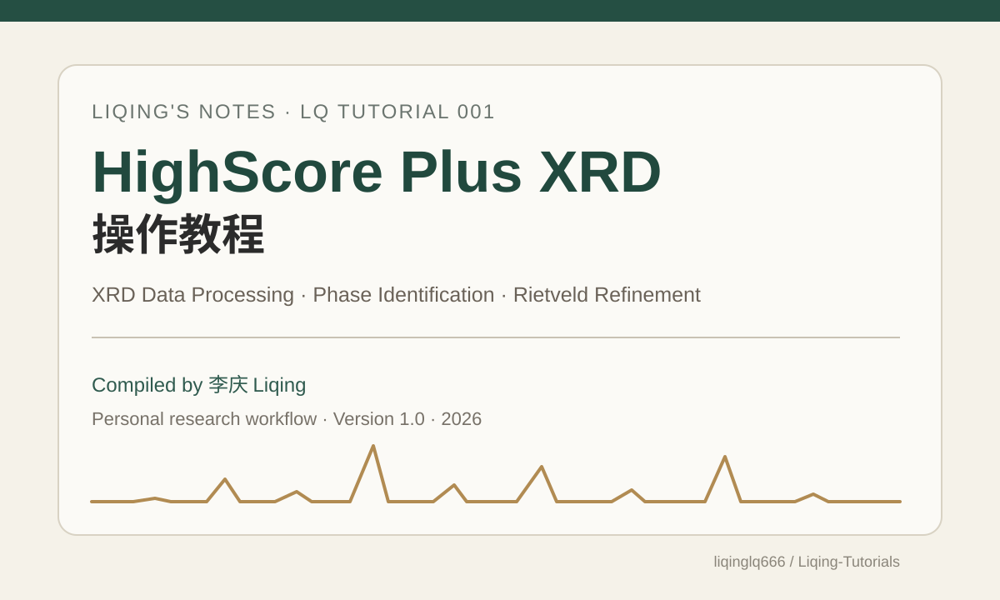
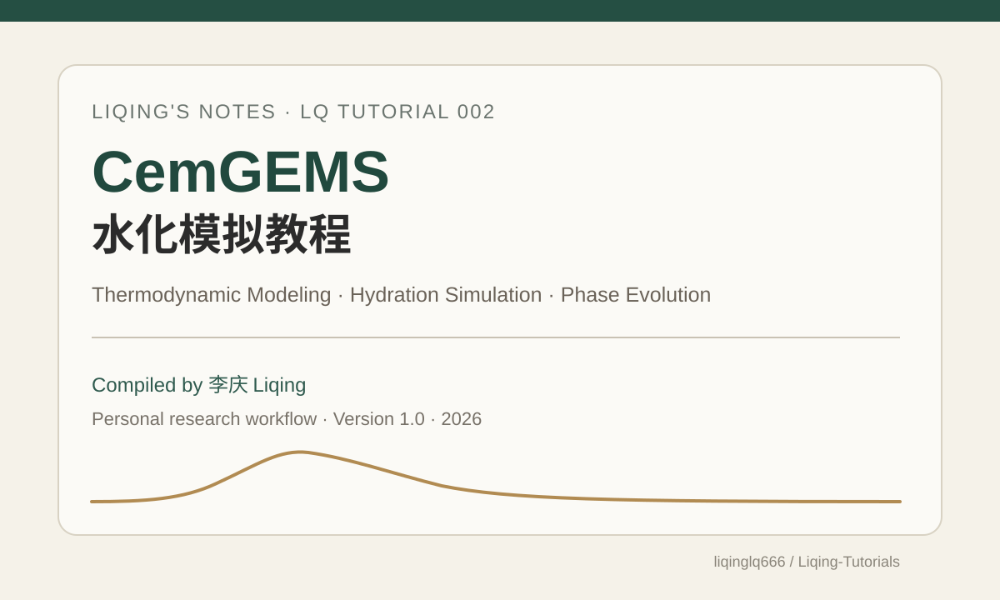

# Liqing Tutorials
### 李庆个人教程合集

个人整理的科研教程与实践笔记。

---

## LQ Tutorial 001 · HighScore Plus XRD 操作教程

  

**XRD Data Processing · Phase Identification · Rietveld Refinement**

[**教程详情 →**](./01-XRD/HighScore-Plus/) · [**完整 PDF →**](./01-XRD/HighScore-Plus/HighScore_Plus_XRD_Tutorial_Liqing_v1.0.pdf)

---

## LQ Tutorial 002 · CemGEMS 水化模拟教程

  

**热力学原理 · 配比建模 · 水化过程模拟 · 结果解读**

[**完整 PDF →**](./02-Hydration/CemGEMS/CemGEMS_Tutorial_Liqing_v1.0.pdf)

---

原创内容采用 CC BY-NC-SA 4.0；第三方软件界面、商标及数据库内容归各自权利人所有。

**李庆 · Liqing**  

